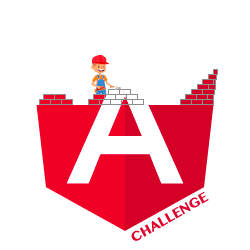

  

Collection of Angular challenges

 

## Intro

This project has been created with three purposes:

- The first purpose is to assist you in becoming better at Angular and its ecosystem. 💪
- The second purpose is to share best practices and different implementations of the same problem to gain diverse perspectives. 📖
- The last one is to lower the barrier to open source contribution.

**Sharing knowledge can benefit everyone.**

Furthermore, if you are struggling with a concept, please open an issue. I will attempt to create a challenge based on that idea.

If you would like to propose a challenge, this project is open source, so feel free to share your ideas. They are more than welcome.

> **Learning by reading is good but learning by doing is better.**

## Challenges

Check [all 60 challenges](https://angular-challenges.vercel.app/)

## Contributors ✨

<!-- ALL-CONTRIBUTORS-LIST:START - Do not remove or modify this section -->
<!-- prettier-ignore-start -->
<!-- markdownlint-disable -->
<table>
  <tbody>
    <tr>
      <td align="center" valign="top" width="14.28%"><a href="https://thomaslaforge.dev/home"> <b>Laforge Thomas</b></a> <a href="#challenge-tomalaforge" title="Create a challenge">🧩</a> <a href="https://github.com/tomalaforge/angular-challenges/commits?author=tomalaforge" title="Code">💻</a> <a href="https://github.com/tomalaforge/angular-challenges/commits?author=tomalaforge" title="Documentation">📖</a> <a href="#content-tomalaforge" title="Content">🖋</a> <a href="#ideas-tomalaforge" title="Ideas, Planning, & Feedback">🤔</a> <a href="#design-tomalaforge" title="Design">🎨</a> <a href="#translation-fr-tomalaforge" title="Translate in French">🇫🇷</a></td>
      <td align="center" valign="top" width="14.28%"><a href="https://svenson95.github.io/sb-portfolio/"> <b>Sven Brodny</b></a> <a href="https://github.com/tomalaforge/angular-challenges/commits?author=svenson95" title="Documentation">📖</a> <a href="#challenge-svenson95" title="Create a challenge">🧩</a> <a href="#content-svenson95" title="Content">🖋</a> <a href="#design-svenson95" title="Design">🎨</a></td>
      <td align="center" valign="top" width="14.28%"><a href="https://github.com/jdegand"> <b>J. Degand</b></a> <a href="https://github.com/tomalaforge/angular-challenges/commits?author=jdegand" title="Documentation">📖</a> <a href="#content-jdegand" title="Content">🖋</a> <a href="https://github.com/tomalaforge/angular-challenges/commits?author=jdegand" title="Code">💻</a></td>
      <td align="center" valign="top" width="14.28%"><a href="https://github.com/DeveshChau"> <b>Devesh Chaudhari</b></a> <a href="https://github.com/tomalaforge/angular-challenges/commits?author=DeveshChau" title="Code">💻</a> <a href="https://github.com/tomalaforge/angular-challenges/issues?q=author%3ADeveshChau" title="Bug reports">🐛</a> <a href="#challenge-DeveshChau" title="Create a challenge">🧩</a></td>
      <td align="center" valign="top" width="14.28%"><a href="https://github.com/stillst"> <b>stillst</b></a> <a href="#challenge-stillst" title="Create a challenge">🧩</a> <a href="#translation-ru-stillst" title="Translate in Russian">🇷🇺</a></td>
      <td align="center" valign="top" width="14.28%"><a href="https://wandrille-guesdon.com/"> <b>Wandrille</b></a> <a href="#challenge-wandri" title="Create a challenge">🧩</a></td>
      <td align="center" valign="top" width="14.28%"><a href="https://twitter.com/alcaidio"> <b>Timothy Alcaide</b></a> <a href="#challenge-alcaidio" title="Create a challenge">🧩</a></td>
    </tr>
    <tr>
      <td align="center" valign="top" width="14.28%"><a href="https://github.com/LMFinney"> <b>Lance Finney</b></a> <a href="https://github.com/tomalaforge/angular-challenges/commits?author=LMFinney" title="Documentation">📖</a> <a href="#challenge-LMFinney" title="Create a challenge">🧩</a></td>
      <td align="center" valign="top" width="14.28%"><a href="https://github.com/tsironis13"> <b>Tsironis Ioannis</b></a> <a href="#challenge-tsironis13" title="Create a challenge">🧩</a></td>
      <td align="center" valign="top" width="14.28%"><a href="https://github.com/alan-bio"> <b>Alan Dragicevich</b></a> <a href="https://github.com/tomalaforge/angular-challenges/commits?author=alan-bio" title="Documentation">📖</a></td>
      <td align="center" valign="top" width="14.28%"><a href="https://github.com/edimitchel"> <b>Michel EDIGHOFFER</b></a> <a href="https://github.com/tomalaforge/angular-challenges/commits?author=edimitchel" title="Documentation">📖</a></td>
      <td align="center" valign="top" width="14.28%"><a href="https://github.com/gsgonzalez88"> <b>Gerardo Sebastian Gonzalez</b></a> <a href="https://github.com/tomalaforge/angular-challenges/commits?author=gsgonzalez88" title="Documentation">📖</a></td>
      <td align="center" valign="top" width="14.28%"><a href="https://github.com/marryday"> <b>Evseev Yuriy</b></a> <a href="https://github.com/tomalaforge/angular-challenges/issues?q=author%3Amarryday" title="Bug reports">🐛</a></td>
      <td align="center" valign="top" width="14.28%"><a href="https://github.com/tomer953"> <b>Tomer953</b></a> <a href="https://github.com/tomalaforge/angular-challenges/issues?q=author%3Atomer953" title="Bug reports">🐛</a> <a href="https://github.com/tomalaforge/angular-challenges/commits?author=tomer953" title="Documentation">📖</a> <a href="https://github.com/tomalaforge/angular-challenges/commits?author=tomer953" title="Code">💻</a></td>
    </tr>
    <tr>
      <td align="center" valign="top" width="14.28%"><a href="https://github.com/dmmishchenko"> <b>Dmitriy Mishchenko</b></a> <a href="https://github.com/tomalaforge/angular-challenges/commits?author=dmmishchenko" title="Documentation">📖</a></td>
      <td align="center" valign="top" width="14.28%"><a href="http://www.sagardev.com.np"> <b>Sagar Devkota</b></a> <a href="https://github.com/tomalaforge/angular-challenges/commits?author=Sagardevkota" title="Documentation">📖</a> <a href="https://github.com/tomalaforge/angular-challenges/commits?author=Sagardevkota" title="Code">💻</a></td>
      <td align="center" valign="top" width="14.28%"><a href="https://nelsonguti.dev/"> <b>Nelson Gutierrez</b></a> <a href="#translation-es-nelsongutidev" title="Translate in Spanish">🇪🇸</a></td>
      <td align="center" valign="top" width="14.28%"><a href="https://github.com/ho-ssain"> <b>Hossain K. M.</b></a> <a href="https://github.com/tomalaforge/angular-challenges/commits?author=ho-ssain" title="Documentation">📖</a></td>
      <td align="center" valign="top" width="14.28%"><a href="https://github.com/kabrunko-dev/"> <b>Diogo Nishikawa</b></a> <a href="https://github.com/tomalaforge/angular-challenges/commits?author=kabrunko-dev" title="Code">💻</a> <a href="#translation-pt-kabrunko-dev" title="Translate in Portuguese">🇵🇹</a> <a href="https://github.com/tomalaforge/angular-challenges/commits?author=kabrunko-dev" title="Documentation">📖</a></td>
      <td align="center" valign="top" width="14.28%"><a href="http://www.streamoverlaypro.com"> <b>Erick Rodriguez</b></a> <a href="#translation-es-ErickRodrCodes" title="Translate in Spanish">🇪🇸</a></td>
      <td align="center" valign="top" width="14.28%"><a href="https://eduardoroth.dev"> <b>Eduardo Roth</b></a> <a href="https://github.com/tomalaforge/angular-challenges/commits?author=eduardoRoth" title="Documentation">📖</a> <a href="#translation-es-eduardoRoth" title="Translate in Spanish">🇪🇸</a></td>
    </tr>
    <tr>
      <td align="center" valign="top" width="14.28%"><a href="https://github.com/1fbr"> <b>Fernando Bello</b></a> <a href="https://github.com/tomalaforge/angular-challenges/commits?author=1fbr" title="Documentation">📖</a></td>
      <td align="center" valign="top" width="14.28%"><a href="https://github.com/webbomj"> <b>Лапин Андрей (Lapin Andrey)</b></a> <a href="#translation-ru-webbomj" title="Translate in Russian">🇷🇺</a></td>
      <td align="center" valign="top" width="14.28%"><a href="https://github.com/Dinozavvvr"> <b>Dinar Shagaliev</b></a> <a href="#translation-ru-Dinozavvvr" title="Translate in Russian">🇷🇺</a></td>
      <td align="center" valign="top" width="14.28%"><a href="https://github.com/vimulatus"> <b>Vimulatus</b></a> <a href="https://github.com/tomalaforge/angular-challenges/commits?author=vimulatus" title="Documentation">📖</a></td>
      <td align="center" valign="top" width="14.28%"><a href="https://github.com/alannelucq"> <b>Arthur LANNELUCQ</b></a> <a href="#translation-fr-alannelucq" title="Translate in French">🇫🇷</a></td>
      <td align="center" valign="top" width="14.28%"><a href="https://github.com/fixedmichal"> <b>fixed_michal</b></a> <a href="https://github.com/tomalaforge/angular-challenges/issues?q=author%3Afixedmichal" title="Bug reports">🐛</a></td>
      <td align="center" valign="top" width="14.28%"><a href="https://github.com/Tenessy"> <b>Tenessy</b></a> <a href="https://github.com/tomalaforge/angular-challenges/issues?q=author%3ATenessy" title="Bug reports">🐛</a></td>
    </tr>
    <tr>
      <td align="center" valign="top" width="14.28%"><a href="https://enochgao.github.io/"> <b>Enoch Gao</b></a> <a href="https://github.com/tomalaforge/angular-challenges/commits?author=EnochGao" title="Documentation">📖</a> <a href="#translation-ch-EnochGao" title="Translate in Chinese">🇨🇳</a></td>
      <td align="center" valign="top" width="14.28%"><a href="https://github.com/fpalmab"> <b>Francisco Palma</b></a> <a href="https://github.com/tomalaforge/angular-challenges/issues?q=author%3Afpalmab" title="Bug reports">🐛</a></td>
      <td align="center" valign="top" width="14.28%"><a href="https://github.com/michalgrzegorczyk-dev"> <b>Michał Grzegorczyk</b></a> <a href="https://github.com/tomalaforge/angular-challenges/commits?author=michalgrzegorczyk-dev" title="Documentation">📖</a></td>
      <td align="center" valign="top" width="14.28%"><a href="https://github.com/tamim36"> <b>Tamim Arefin Anik</b></a> <a href="https://github.com/tomalaforge/angular-challenges/issues?q=author%3Atamim36" title="Bug reports">🐛</a></td>
      <td align="center" valign="top" width="14.28%"><a href="https://github.com/WhoisBsa"> <b>Matheus B.</b></a> <a href="https://github.com/tomalaforge/angular-challenges/issues?q=author%3AWhoisBsa" title="Bug reports">🐛</a></td>
      <td align="center" valign="top" width="14.28%"><a href="https://sourcerer.io/stefh"> <b>Stef Heyenrath</b></a> <a href="https://github.com/tomalaforge/angular-challenges/commits?author=StefH" title="Documentation">📖</a></td>
      <td align="center" valign="top" width="14.28%"><a href="https://github.com/mathisvester"> <b>mathisvester</b></a> <a href="https://github.com/tomalaforge/angular-challenges/issues?q=author%3Amathisvester" title="Bug reports">🐛</a></td>
    </tr>
  </tbody>
  <tfoot>
    <tr>
      <td align="center" size="13px" colspan="7">
        
          <a href="https://all-contributors.js.org/docs/en/bot/usage">Add your contributions</a>
        </img>
      </td>
    </tr>
  </tfoot>
</table>

<!-- markdownlint-restore -->
<!-- prettier-ignore-end -->

<!-- ALL-CONTRIBUTORS-LIST:END -->

Contributions of any kind are welcome.

If I have forgotten to add you as a contributor, please reach out to me. 🙏

## License

MIT
