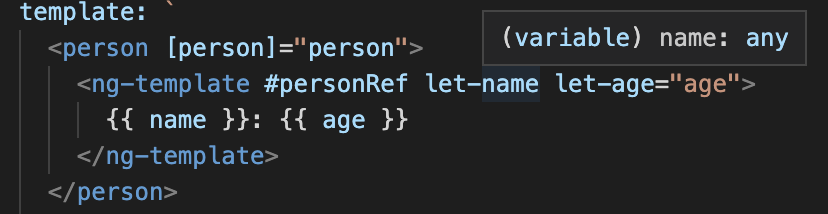
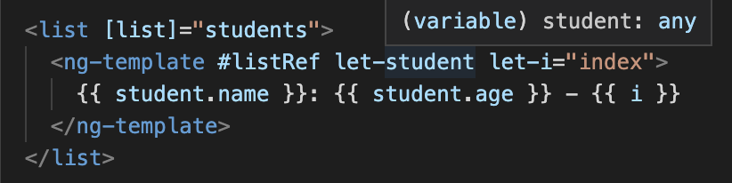

<h1>NgTemplateOutlet Strongly Typed</h1>

> Author: Thomas Laforge

## Information

Angular offer the static function **ngTemplateContextGuard** to strongly type structural directive.

However the context of **NgTemplateOutlet** type is **Object**. But which the help of the above guard, we can improve that behavior.

## Statement

In this exercice, we want to learn how to strongly typed our ng-template in our AppComponent.

This exercice has two level of complexity.

### Level 1: known Interface

Currently we have the following piece of code.

As we can see, name is of type "any". We want to infer the correct type.

### Level 2: generic Interface

Currently we have the following piece of code.

As we can see, student is of type "any". We want to infer the correct type.

But in this part, we can pass to ListComponent, a list of **any object**. And we still want the correct type to be infered.

## Submitting your work

1. Fork the project
2. clone it
3. npm install
4. **nx serve context-outlet-type**
5. _...work On it_
6. Commit your work
7. Submit a PR with a title beginning with **Answer:4** that I will review and other dev can review.

_You can ask any question on_ 
