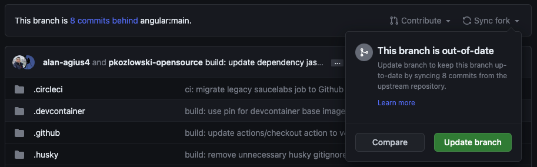

En ocasiones, pueden agregarse cambios al proyecto. Intentaré hacer cambios que no rompan nada, pero a veces es inevitable.

La mayoría de las veces, no necesitarás hacer rebase a tu solución, pero aquí hay una guía para ayudarte a saber cómo hacerlo en caso de ser necesario.

:::note[Nota]
Esta guía es aplicable a cualquier Proyecto de Código Abierto.
:::

## Pasos para hacer rebase a tu rama

### Sincroniza tu repositorio

Primero, necesitas sincronizar tu fork para asegurarte de que esté actualizado con el repositorio bifurcado.

Puedes lograr esto haciendo clic en el botón Sync fork en la página principal de tu fork.

La imagen de arriba muestra que mi rama está detrás de la rama principal por 8 commits, y necesito sincronizarla para estar actualizada.

### Abre una terminal

Abre cualquier terminal de tu elección, ya sea la de tu IDE favorito o una instancia independiente.

### Git

Sigue los siguientes comandos para hacer rebase a tu rama local:

- git checkout main
- git pull
- git checkout [tu rama]
- git rebase main
- Resuelve los conflictos

En este paso, el rebase puede detenerse porque tu rama local tiene archivos conflictivos con la rama principal. Corrígelos. Después de esto:

- git add .
- git rebase --continue

Si tu rama no tiene conflictos, se mostrará un mensaje de éxito.

### Envía tu trabajo de vuelta a la rama remota

Finalmente, envía tu trabajo de vuelta a GitHub:

- git push -f
