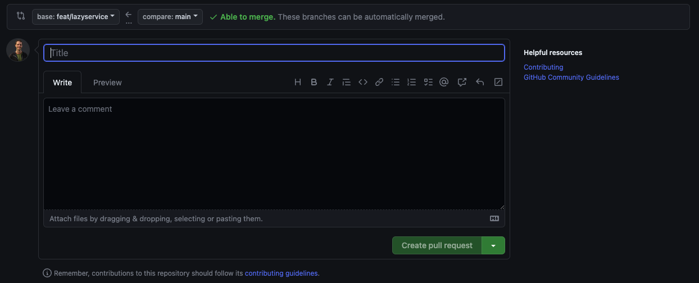

En esta guía, aprenderás cómo resolver un desafío y enviar una respuesta al repositorio principal de GitHub.

## Introducción

Este repositorio ha sido creado utilizando [Nx](https://nx.dev/getting-started/intro). <b>Nx</b> es un monorepositorio que te permite almacenar múltiples aplicaciones dentro del mismo espacio de trabajo. Cada desafío es una aplicación separada. Si abres el directorio `apps`, encontrarás múltiples directorios, cada uno relacionado con un desafío específico. Cada directorio representa una aplicación `Nx` completa e independiente. Para ejecutar e iniciar una, abre tu terminal y ejecuta:

```bash
npx nx serve <NOMBRE_DE_LA_APLICACION>
```

:::note[Nota]
Si no estás seguro de tu `NOMBRE_DE_LA_APLICACION`, abre el archivo README.md. El comando `serve` está escrito allí, con un enlace a la documentación del desafío.
:::

:::note[Nota]
Si `nx` está instalado globalmente en tu dispositivo, puedes omitir el uso de `npx`.

Para instalar `nx` globalmente, ejecuta

```bash
npm i -g nx
```

:::

## Crear una Rama de Git

Antes de comenzar a implementar tu solución para resolver un desafío, crea una rama de git para comprometer tu trabajo.

```bash
git checkout -b <NOMBRE_DE_LA_RAMA>
```

## Resolver el Desafío

Sigue las instrucciones para resolver el desafío.

## Hacer Commit y Enviar tu Trabajo

El último paso es hacer `commit` a tu trabajo siguiendo las [Directrices Convencionales](https://www.conventionalcommits.org/en/v1.0.0/).

Finalmente, envía tu trabajo al repositorio remoto con el siguiente comando

```bash
    git push --set-upstream origin <NOMBRE_DE_LA_RAMA>
```

:::tip[No es necesario que lo memorices]
No tienes que recordar el comando con precisión. Solo necesitas recordar `git push` y si es la primera vez que estás enviando esta rama, `git` te proporcionará el comando completo.
:::

## Enviar tu Trabajo al Repositorio Principal

Ahora, todo tu trabajo está ubicado dentro de tu instancia local del repositorio de Desafíos de Angular.

El siguiente paso es ir a la página principal de [Desafíos de Angular](https://github.com/tomalaforge/angular-challenges) y crear una nueva Pull Request.

Si no es asi, es posible que hayas hecho incorrectamente uno de los pasos anteriores o puedes ir a la pestaña <b>Pull Request</b> y hacer click en el botón <span class="github-success-btn">New pull request</span>.

Una vez hayas escogido las dos ramas a comparar, deberías llegar a la siguiente página:



En la sección de título, comienza con <b>Answer:</b> seguido de tu <b>challenge number</b>. Después de eso, eres libre de agregar cualquier cosa que desees.

:::danger[Importante]
Esto es muy importante. Le permite a otros saber qué desafío estás intentando resolver.
:::

En la sección de descripción, puedes agregar preguntas, problemas que hayas encontrado o cualquier otra cosa que quieras compartir. Puedes dejarlo vacío si no tienes nada que decir.

Ahora puedes hacer click en <span class="github-success-btn">Create pull request</span>.

Lo leeré y comentaré cuando tenga algo de tiempo libre.

:::note[Nota]
Todos son bienvenidos a comentar y leer otros PR.
:::

:::tip[Campeón de OSS]
🔥 Una vez que hayas completado este tutorial, estarás listo para contribuir a cualquier otro repositorio público de GitHub y enviar un PR. Es tan fácil como eso. 🔥
:::
