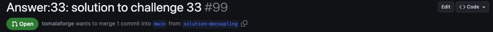
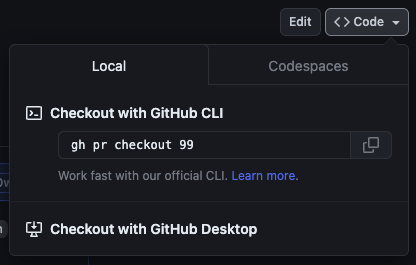

Todas as respostas do Desafios Angular são apresentadas na forma de Pull Request (PR). Para ver e seguir elas, navegue pela página **Files Changes** no GitHub. Entretanto, entender e seguir esse processo pode não ser direto se você não estiver familiarizado com a interface. Muitas vezes, você pode preferir verificar a branch e revisar a solução na sua IDE de preferência.

Este guia foi criado para ajudar você a conseguir isso.

## Confire PR de outra pessoa localmente

### Sincronize seu repositório

Primeiro, você precisa sincronizar seu fork para garantir que ele está atualizado com o repositório bifurcado.

Isso pode ser feito clicando no botão Sync fork na página principal de seu fork.


A imagem acima mostra que minha branch está atrás da branch principal por 8 commits, e será necessário sincronizá-la para deixar ela atualizada.


### Confira localmente

Vá até o PR que desejar conferir localmente e pegue seu ID. Você o achará no título do PR (como mostrado abaixo).



Depois, abra um terminal dentro do diretório de seu projeto e execute o seguinte comando:

```bash
gh pr checkout <ID>
```

Se você não lembrar o comando, clique no butão <span class="github-neutral-btn"><> Code</span> no lado direito do cabeçalho e você poderá copiar/colar o comando.



:::note[Nota]
Se o comando não funcionar ou fracassar, a CLI do GitHub vai guiar você durante o processo.
:::

🔥 Agora você pode navegar nas soluções localmente e rodá-las para testar. 🔥

<!-- gh repo set-default -->
