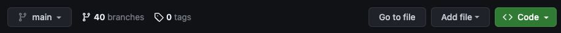

Чтобы начать работу с <b>испытаниями Angular</b>, выполните следующие шаги:

## Создайте аккаунт на GitHub

Если вы захотите отправить свое решение для испытания, вам потребуется аккаунт на GitHub. Кроме того, иметь учетную запись на GitHub всегда полезно, тем более это бесплатно.

## Скопируйте GitHub проект

Перейдите в [Angular Challenges Repository](https://github.com/tomalaforge/angular-challenges) и нажмите на кнопку <span class="github-neutral-btn"> <svg aria-hidden="true" height="16" viewBox="0 0 16 16" version="1.1" width="16" data-view-component="true" class="octicon octicon-repo-forked mr-2">
<path d="M5 5.372v.878c0 .414.336.75.75.75h4.5a.75.75 0 0 0 .75-.75v-.878a2.25 2.25 0 1 1 1.5 0v.878a2.25 2.25 0 0 1-2.25 2.25h-1.5v2.128a2.251 2.251 0 1 1-1.5 0V8.5h-1.5A2.25 2.25 0 0 1 3.5 6.25v-.878a2.25 2.25 0 1 1 1.5 0ZM5 3.25a.75.75 0 1 0-1.5 0 .75.75 0 0 0 1.5 0Zm6.75.75a.75.75 0 1 0 0-1.5.75.75 0 0 0 0 1.5Zm-3 8.75a.75.75 0 1 0-1.5 0 .75.75 0 0 0 1.5 0Z"></path></svg>Fork</span> в вверху страницы. Это создаст копию репозитория на вашей GitHub странице.

## Клонируйте репозиторий на свой компьютер

Выберите папку на своем компьютере и клонируйте репозиторий.

Откройте терминал, перейдите в выбранный каталог и наберите команду:

```bash
git clone https://github.com/[YOUR_GITHUB_NAME]/angular-challenges.git
```

:::note

Вы можете найти URL адрес клонированного репозитория, нажав на кнопку <span class="github-success-btn"><> Code</span> в <b>вашем собственном</b> экземпляре репозитория Angular Challenges.



:::

## Откройте проект в вашей любимой среде разработки

Откройте проект в любой IDE на ваш выбор.

## Установите все зависимости

```bash
npm ci
```

## Выберите задачу

Ваш проект сейчас поднят и запущен. Осталось только выбрать испытание 🚀

Каждое испытание состоит из:

- <b>Имя</b>: описывает о чем испытание.
- <b>Номер</b>: порядковый номер создания. Этот номер не несет какого-то смысла, но служит для ссылки в секции GitHub Pull Request.
- <b>Бейдж</b>: показывает уровень сложности. Полностью субъективно 😅
  - 🟢 простое
  - 🟠 среднее
  - 🔴 сложное
