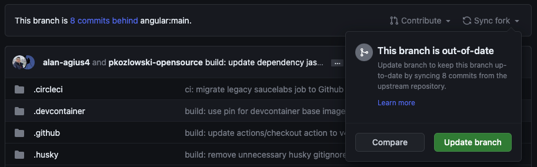

Иногда в проект могут вноситься изменения. Я стараюсь вносить изменения, которые ничего не сломают, но иногда этого не избежать.

В большинстве случаев вам не придется делать rebase вашего решения, но вот руководство, которое поможет вам понять, как это сделать.

:::note[Примечание]
Это руководство применимо к любому проекту с открытым исходным кодом.
:::

## Шаги rebase

### Синхронизируйте ваш репозиторий

Во-первых, вам нужно синхронизировать вашу копию, чтобы убедиться, что она содержит последние изменения.

Вы можете сделать это, нажав на кнопку Sync fork на главной странице вашего репозитория.

На изображении выше видно, что моя ветка отстает от основной ветки на 8 коммитов, и мне нужно синхронизировать ее, чтобы она была в актуальном состоянии.

### Откройте терминал

Откройте любой терминал, будь то терминал в любимой IDE или отдельное приложение.

### Гит

Выполните следующие команды, чтобы сделать rebase локальной ветки:

- git checkout main
- git pull
- git checkout [your branch]
- git rebase main
- Разрешите конфликты

На этом этапе rebase может остановиться, потому что в вашей локальной ветке есть конфликтующие файлы с основной веткой. Исправьте это. После того как закончите:

- git add .
- git rebase --continue

Если в вашей ветке нет конфликтов, будет показано сообщение об успехе.

### Отправьте свою работу в удаленный репозиторий

Наконец, отправьте свою работу на GitHub:

- git push -f
