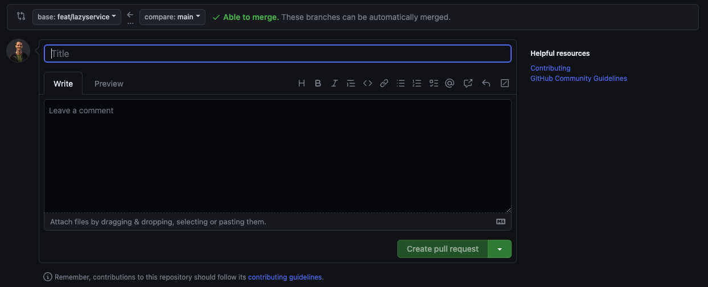

在本指南中，您将学习如何解决挑战并向主GitHub存储库提交答案。

## 介绍

此存储库由 [Nx](https://nx.dev/getting-started/intro) 提供支持。<b>Nx</b>是一个 monorepository，允许您将多个应用程序存储在同一个工作区中。每个挑战都是一个单独的应用程序。如果您打开`apps`目录，您将找到多个目录，每个目录都与一个特定的挑战相关。每个目录都代表一个完整的独立的`Nx`应用程序。想要运行并从某个开始，请打开您的终端并运行：

```bash
npx nx serve <APPLICATION_NAME>
```

:::note[注意]
如果您不确定 `APPLICATION_NAME` ，请打开README.md文件。 `serve` 命令写在那里，并有一个到挑战文档的链接。
:::

:::note[注意]

如果您的设备已全局安装 `nx` ，则可以跳过使用 `npx`

要全局安装 `nx` ，使用

```bash
npm i -g nx
```

:::

## 创建 Git 分支

在你开始实现解决挑战的解决方案之前，创建一个git分支来提交你的工作。

```bash
git checkout -b <BRANCH_NAME>
```

## 完成挑战

按照说明来完成挑战。

## 提交和推送您的工作

最后一步是按照常规的[指导方针](https://www.conventionalcommits.org/en/v1.0.0/)提交工作

最后，使用以下命令将工作推送到远程仓库

```bash
    git push --set-upstream origin <BRANCH_NAME>
```

:::tip[不用去记]
你不必精确地记住这个命令。你只需要记住 `git push` ，如果这是你第一次推送这个分支， `git` 将为你提供完整的命令。
:::

## 将您的工作提交到主仓库

现在，你所有的工作都位于Angular Challenges仓库的本地实例中。

下一步是转到Angular的主要[挑战页面](https://github.com/tomalaforge/angular-challenges)，并创建一个新的Pull Request。

GitHub应该显示一个通知头来帮助你创建拉取请求。

如果不是这样，要么是你错误地执行了前面的某个步骤，要么你可以转到<b>Pull Request</b>选项卡并点击<span class="github-success-btn">New pull request</span>按钮

一旦你选择了要比较的两个分支，就会看到下面的页面:



在标题部分，以<b>Answer:</b>开始，然后是你的<b>挑战号</b>。之后，您可以随意添加任何您想要的内容

:::danger[危险]
这非常重要。它让别人知道你试图解决的是什么挑战。
:::

在描述部分，您可以添加您遇到的问题、麻烦或任何其他您想要分享的内容。如果你没什么可说的，可以把它空着

现在你可以点击 <span class="github-success-btn">Create pull request</span>.

## 获取审查

为了继续提供有价值的反馈和评论，<a href="https://github.com/sponsors/tomalaforge">请在Github上支持这个项目</a>:

<ul>
<li>每次评论5美元</li>
<li>终身评论25美元</li>
<li>创建一个挑战/贡献终身评论</li>
</ul>

:::note[注意]

您仍然可以提交您的PR加入已回答的挑战列表。你仍然可以被社区成员审查🔥

欢迎大家评论和阅读其他PRs。💪
:::

:::tip[开源拥护者]
🔥完成本教程后，您就可以为任何其他公共GitHub存储库做出贡献并提交PR。就这么简单。🔥
:::
