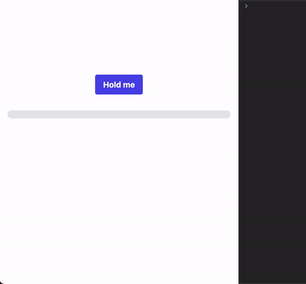

## Context

As a member of the development team, you have to respond to a specific request from the UX designer, 👩🏻‍🎨 Lucie, who has designed a button that must be held down for X amount of time to save a save request.

Sacha 👶🏼 the trainee has already integrated the design but doesn't know how to perform the "holdable" functionality.

So you're going to take over from him.

## Functional expectation

> "As a user, I would like to save something by holding down the button for a certain amount of time."

Here is the prototype made by Lucie:

## Acceptance Criteria

1. We should be able to configure a maintenance duration in milliseconds.
2. Pressing and holding the button triggers the countdown on the `mousedown` event.
3. On `mouseleave` or `mouseup` events, the progress bar is reset to 0.
4. The progress bar representing the remaining relative time should reflect the remaining time.
5. Simulates a backend request when the hold time is over (console log or alert).
6. You must maximize the use of RxJS operators and be as declarative as possible.

    
Tips 🤫 (if you really need it and after careful consideration)

    <ul>
      <li>Create the `HoldableDirective`</li>
      <li>Use `TemplateRef` and `fromEvent` from RxJS to catch events or `@HostListener`</li>
      <li>Perhaps the following RxJS operators can help you: interval, takeUntil, switchMap, takeWhile/retry...</li>
    </ul>

