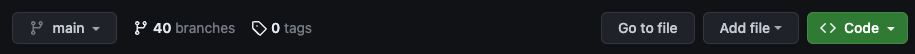

Para comenzar con <b>Desafió de Angular</b>, siga estos pasos:

## Crea una cuenta de Github

Si desea enviar una solución, deberá tener su propia cuenta de GitHub. Además, tener una cuenta de GitHub siempre es beneficioso y es gratis.

## Crea un fork del proyecto de github

Navegue al [Repositorio de Desafíos de Angular](https://github.com/tomalaforge/angular-challenges) y haga clic en el <span class="github-neutral-btn"> <svg aria-hidden="true" height="16" viewBox="0 0 16 16" version="1.1" width="16" data-view-component="true" class="octicon octicon-repo-forked mr-2">
<path d="M5 5.372v.878c0 .414.336.75.75.75h4.5a.75.75 0 0 0 .75-.75v-.878a2.25 2.25 0 1 1 1.5 0v.878a2.25 2.25 0 0 1-2.25 2.25h-1.5v2.128a2.251 2.251 0 1 1-1.5 0V8.5h-1.5A2.25 2.25 0 0 1 3.5 6.25v-.878a2.25 2.25 0 1 1 1.5 0ZM5 3.25a.75.75 0 1 0-1.5 0 .75.75 0 0 0 1.5 0Zm6.75.75a.75.75 0 1 0 0-1.5.75.75 0 0 0 0 1.5Zm-3 8.75a.75.75 0 1 0-1.5 0 .75.75 0 0 0 1.5 0Z"></path></svg>Fork</span> button in the header. This will create a copy of this repository on your own GitHub page.

## Clone el repositorio en su máquina local

Seleccione un directorio en su computadora local y clone este repositorio.

Abra una terminal, navegue hasta el directorio elegido y escriba el siguiente comando:

```bash
git clone https://github.com/[YOUR_GITHUB_NAME]/angular-challenges.git
```

:::note
Puede encontrar la URL de clonación haciendo clic en el botón <span class="github-success-btn"><> Code</span> en su <b>propia instancia</b> del repositorio de Desafíos de Angular.



:::

## Abra el proyecto en su IDE favorito

Abra el proyecto en cualquier IDE de su elección.

## Instale todas las dependencias

```bash
npm ci
```

## Escoja un desafío

Su proyecto ahora está corriendo. El único paso restante es elegir un desafío 🚀

Cada desafío consta de:

- <b>Nombre</b>: indicando de qué se trata el desafío.
- <b>Número</b>: orden de creación. El número no tiene ningún significado en particular, pero ayuda para hacer referencia en la sección de Pull Request de Github.
- <b>Badge</b>: ayuda a visualizar el grado de dificultad. Es totalmente subjetivo 😅
  - 🟢 fácil
  - 🟠 medio
  - 🔴 difícil
