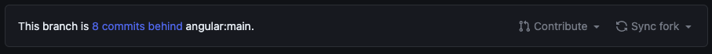
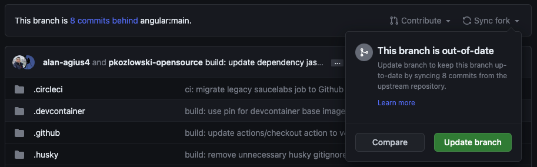
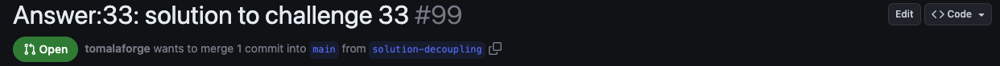
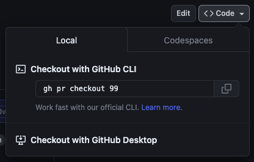

All Angular Challenges answers will be presented in the form of a Pull Request (PR). To view and follow them, navigate through the **Files Changes** page on GitHub. However, understanding and following this process may not be straightforward if you are not familiar with the interface. In many cases, you may prefer to check out the branch and review the solution in your preferred IDE.

This guide has been created to help you in achieving this.

## Checkout a PR locally from someone else

### Sync your repository

First you need to synchronize your fork to ensure it is up to date with the forked repository.

This can be archieved by clicking the **Sync fork** button on the main page of your fork.



The image above shows that my branch is behind of the main branch by 8 commits, and I need to synchronize it to be up to date.



### Checkout locally

Navigate to the PR you wish to check out locally and obtain its ID. You will find it in the title of the PR (as shown below).



Next, go to any terminal within your project directory and run the following command:

```bash
gh pr checkout <ID>
```

If you don't remember the command, click on the Code button on the right side of the header, and you can easily copy/paste the command.



:::note
If the command doesn't work or fails, Github CLI will guide you through the process.
:::

🔥 You can now navigate through the solution locally and serve it to test it. 🔥

<!-- gh repo set-default -->
