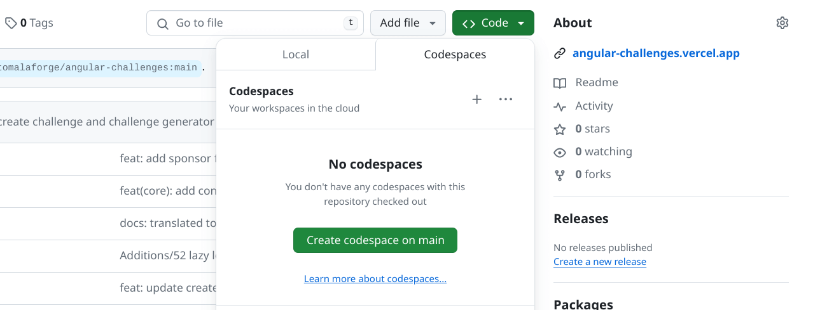

要开始使用 <b>Angular Challenges</b>，请按照以下步骤操作：

## 创建一个GitHub账户

如果你想提交答案，你需要拥有自己的GitHub账户。此外，拥有GitHub账户总是有益的，而且是免费的。

## Fork GitHub 项目

导航至 [Angular Challenges Repository](https://github.com/tomalaforge/angular-challenges) 在页面顶部点击 <span class="github-neutral-btn"> <svg aria-hidden="true" height="16" viewBox="0 0 16 16" version="1.1" width="16" data-view-component="true" class="mr-2 octicon octicon-repo-forked">
<path d="M5 5.372v.878c0 .414.336.75.75.75h4.5a.75.75 0 0 0 .75-.75v-.878a2.25 2.25 0 1 1 1.5 0v.878a2.25 2.25 0 0 1-2.25 2.25h-1.5v2.128a2.251 2.251 0 1 1-1.5 0V8.5h-1.5A2.25 2.25 0 0 1 3.5 6.25v-.878a2.25 2.25 0 1 1 1.5 0ZM5 3.25a.75.75 0 1 0-1.5 0 .75.75 0 0 0 1.5 0Zm6.75.75a.75.75 0 1 0 0-1.5.75.75 0 0 0 0 1.5Zm-3 8.75a.75.75 0 1 0-1.5 0 .75.75 0 0 0 1.5 0Z"></path></svg>Fork</span> 按钮。这将在您的 GitHub 个人资料中创建该存储库的副本。

## 将存储库克隆到您的本地机器上

在您的本地计算机上选择一个目录，然后克隆此存储库。

打开终端，导航到选择的目录，并输入以下命令：

```bash
git clone https://github.com/[YOUR_GITHUB_NAME]/angular-challenges.git
```

:::note[注意]

你可以通过点击Angular Challenges存储库中<b>你自己的实例</b>中的<span class="github-success-btn"><> Code</span> 按钮来找到克隆URL


:::

## 在您最喜欢的IDE中打开该项目

使用您选择的任意集成开发环境（IDE）打开该项目。

## 安装所有依赖项

```bash
npm ci
```

## 选择一个挑战

您的项目现已启动并正在运行。剩下的唯一步骤是选择一个挑战 🚀

每项挑战包括：

- <b>Name</b>: 表示挑战的内容。
- <b>Number</b>: 创建顺序。 这个数字没有任何特别的含义，但有助于在 GitHub Pull Request 部分进行参考。
- <b>Badge</b>: 有助于可视化难度程度。这完全是主观的 😅
  - 🟢 容易
  - 🟠 中等
  - 🔴 困难

## (交替) 使用 GitHub Codespaces

在你自己的 Angular Challenges 存储库<b>实例</b>中，单击代码按钮并导航到 codespaces 选项卡。



单击 `Create codespace on main` 按钮, 您将导航到 GitHub codespace

如果您以前从未使用过 GitHub codespace，我建议您尝试这个简短的交互式 [GitHub Skills Tutorial](https://github.com/skills/code-with-codespaces).

当您导航到codespace时，将出现一个提示，要求安装推荐的 `VS Code` 插件。如果您打算创建一个挑战，您可以使用 `Nx plugin` 来生成开始代码。无论哪种方式，codespace都将安装依赖项，你可以创建一个新分支，解决任何挑战，并创建一个pull request。

当您推送到分支时，您不必提供 GitHub 令牌。

一旦你完成，记得暂停或删除你的codesace。如果不这样做，GitHub将在30分钟后自动暂停空闲的codesace。你每个月确实有大量的免费codespace时间，但重要的是不要浪费你的分配时间

在GitHub codesace中，复制和粘贴将被阻止，直到你获得许可

GitHub codespace使用端口转发为项目提供服务。单击运行 `npx nx serve [project-name]` 后的提示符，导航到 `localhost:4200` 。
