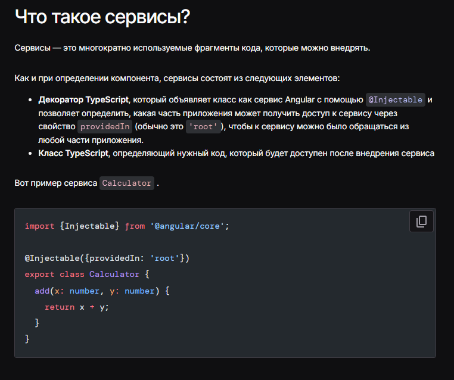
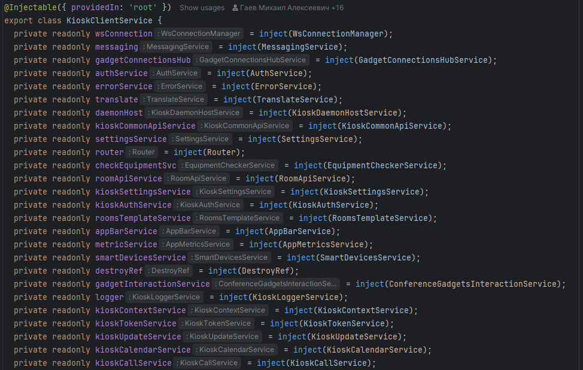
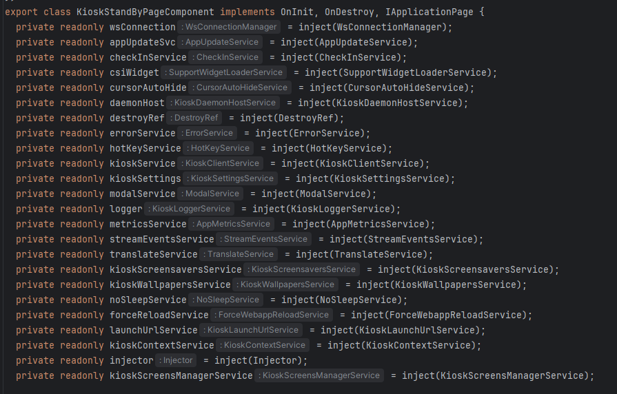
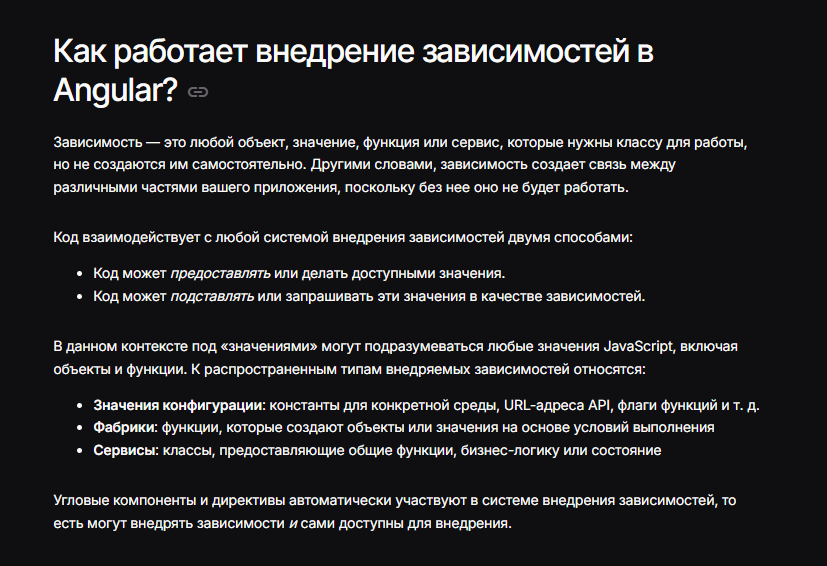
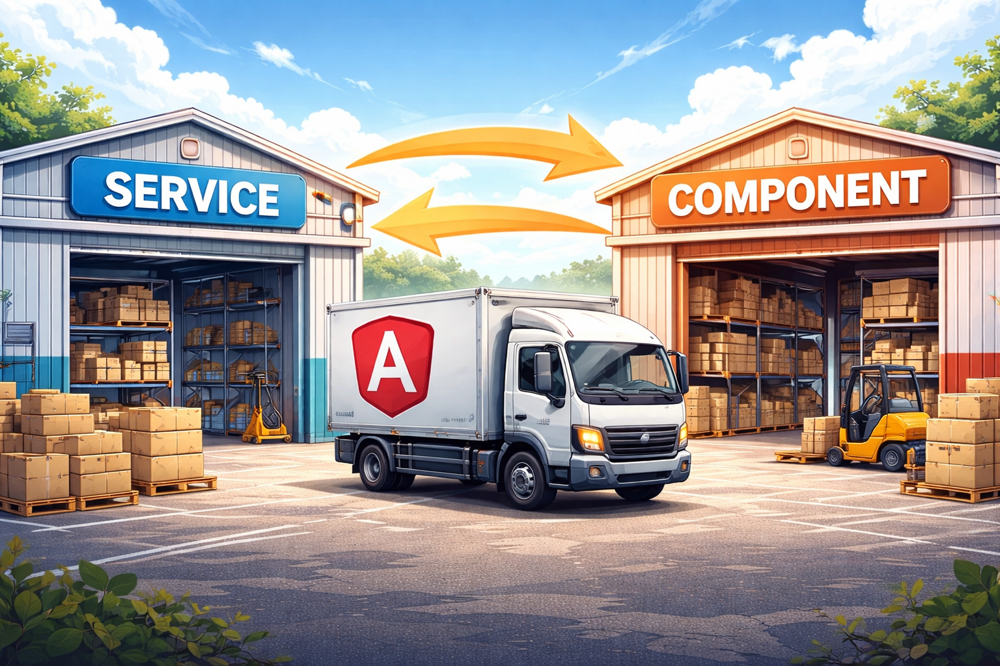
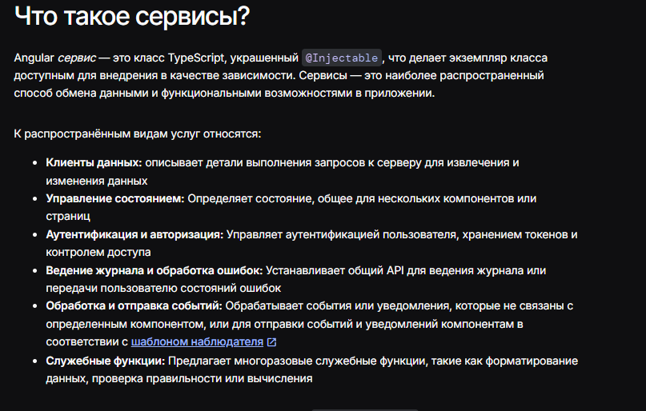
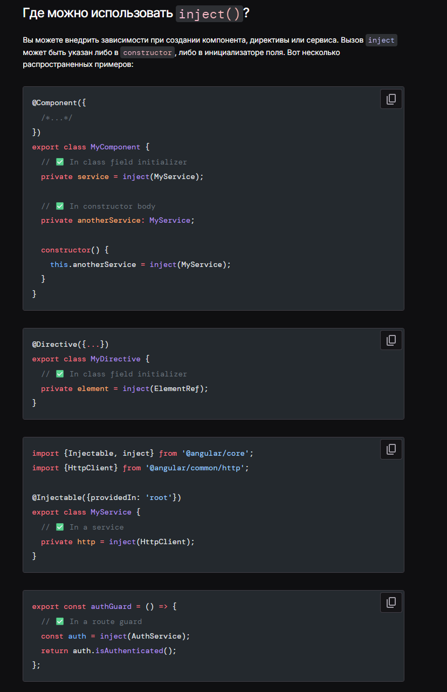
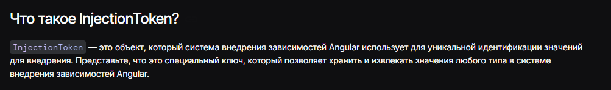
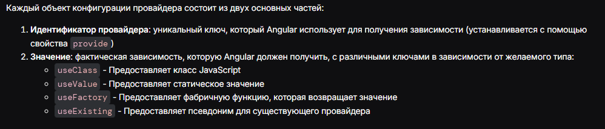
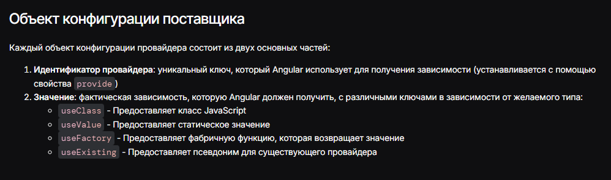

# Базовые знания
Это МАСТХЕВ, синтаксический сахар, называйте как хотите, лучшее изобретение человечества, или в простонародье - Инъекции зависимостей.

Далее по тексту будем называть их инжекторы, инжекция (сути не меняет)

**Дисклеймер**

В этом руководстве ничего нового не придумано, лишь кратко и важно показаны основные моменты использования и пользы для разработки, вся информация есть в [официальной документации](https://angular.dev/).

Отлично, а теперь поехали!

А начнём с примера, когда мир не знал о зависимостях и жил как придётся...


### Без DI (жёсткая зависимость)
Прокидываем и создаём реализации на месте.

```
export class Auth { 
  private _token: string;  
  
  get token(): string {  
    return this._token;  
  }  
  
  auth(token: string) {  
    this._token = token;  
  }  
}  
  
class User {  
  id: string;  
  name: string;  
    
  getUser(token: string): User {  
    const user = http.get({token});   
      
    this.id = user.id;  
    this.name = user.name;  
      
    return user  
  }  
}  


/*component*/  
  
constructor() {  
  const authClass = new Auth();  
  const userClass = new User();  
  authClass.auth()  
  userClass.getUser(authClass.token)  
}
```

Ну это никуда не годится, тут и расширять тяжело, и передавать куда-то ниже зависимости только через prop-drilling, нам такое не надо. Мы будем использовать DI!


### С DI (модульно и расширяемо)
Класс зависит от **интерфейса**, а не от реализации.

```
export class AuthService {  
  private _token: string;  
  
  get token(): string {  
    return this._token;  
  }  
  
  auth(token: string) {  
    this._token = token;  
  }  
}  
  
class UserService {  
  private readonly authService: AuthService;  
    
    
  id: string;  
  name: string;  
  
  getUser() {  
    const user = http.get({token: this.authService.token});  
  
    this.id = user.id;  
    this.name = user.name;  
  
    return user  
  }  
}  
  
/*component*/  
  
private readonly UserService: UserService;  
private readonly authService: AuthService;  
  
  
constructor() {  
  this.authService.auth()  
  this.userService.getUser()  
}
```

Вот тут то, что надо! Высший сорт. Теперь при расширении: просто добавим поле или функцию в нужный сервис. при использовании значения в нескольких местах: прокинем его в нужные компоненты по дереву. Ну это же круто!

## Что такое сервисы

[ссылка на доку](https://angular.dev/essentials/dependency-injection)


По сути DI очень выручает в сложных и комплексных компонентах или смежных сервисах, для переиспользования кода и чёткой иерархии и структуры данных и операций с ними

## Живой пример

Пример, насколько могут быть комплексными сервисы и компоненты. Да, стоит подумать над дроблением таких махин, но не об этом наша лекция.






## Давайте разберёмся



Для своего понимания, абстрактно, можно представить 2 склада слева Service, справа Component. Исходя из потребностей между складами курсируют нужные нам данные (в целом эта абстракция описывает все DI)



Чтобы наши "склады" работали, необходимо задать им контекст.
Вообще, с чего мы решили, что эти классы - являются Сервисами?



Создадим пробный сервис:

```
import {Injectable} from '@angular/core';
@Injectable({providedIn: 'root'})
export class LoggerService {
  log(category: string, value: string) {
    console.log('event logged:', {
      category,
      value,
      timestamp: new Date().toISOString(),
    });
  }
}
```

Теперь разберём что тут к чему:

В начале указываем ключевое слово-декоратор `@Injectable`
Оно делает экземпляр класса доступным для внедрения в качестве зависимости **`EnvironmentInjector`**

С первым словом понятно, но что означает `providedIn`?

Это и есть наш контекст для сервисов, окружение в котором они функционируют.
`'root'` - как не трудно понять, делает эту службу доступной во всем приложении как **одноэлементную**. Это рекомендуемый подход для большинства служб.

%%  одноэлементная - singleton, означает, что эта служба ОДНА на всё приложение, не будет второй точно такой же %%

*В provideIn можно указать и другие значения - о них будем говорить позже*

`{ providedIn?: Type<any> | "any" | "root" | "platform" | null | undefined; factory: () => T; } | undefined`

- **Экземпляры для конкретных компонентов** — когда компонентам нужны собственные изолированные экземпляры сервисов
- **Ручная настройка** — для сервисов, требующих настройки во время выполнения
- **Фабричные провайдеры** — для динамического создания сервисов в зависимости от условий выполнения
- **Провайдеры значений** — для предоставления объектов конфигурации или констант

*Ангуляр сам под капотом разруливает все места использования ProvideIn и пушит их в свой DI Контейнер*


С определением разобрались, а как использовать наш сервис?

Создадим компонент, для нашего сервиса:

```
import {Component, inject} from '@angular/core';
import {Router} from '@angular/router';
import {logger} from './logger';
@Component({
  selector: 'app-navbar',
  template: `<a href="#" (click)="navigateToDetail($event)">Detail Page</a>`,
})
export class Navbar {
  private router = inject(Router);
  private logger = inject(LoggerService);
  
  navigateToDetail(event: Event) {
    event.preventDefault();
    this.logger.log('navigation', '/details');
    this.router.navigate(['/details']);
  }
}
```

Для использования мы используем функцию, предоставляемую ангуляром, `inject()`
Она и добавляет к нашему "складу-компоненту" маршрут к "складу-сервису LoggerService"

Важно указывать `inject()` в конструкторе или в поле класса, так называемый «контекст внедрения»



Такое использование в целом покрывает 90% потребностей в данных для компонентов.
учитываем ещё то, что сервисы не должны быть зависимы друг от друга (циклическая зависимость)

## Циклическая зависимость

```
import { Injectable } from '@angular/core';
import { ServiceB } from './service-b.service';

@Injectable({
  providedIn: 'root'
})
export class ServiceA {

  constructor(private serviceB: ServiceB) {}

  getDataFromB() {
    return this.serviceB.getData();
  }

  getData() {
    return 'Data from Service A';
  }

}
```

```
import { Injectable } from '@angular/core';
import { ServiceA } from './service-a.service';

@Injectable({
  providedIn: 'root'
})
export class ServiceB {

  constructor(private serviceA: ServiceA) {}

  getDataFromA() {
    return this.serviceA.getData();
  }

  getData() {
    return 'Data from Service B';
  }

}
```

### Что здесь происходит

Получается цикл:

ServiceA → ServiceB → ServiceA

Angular пытается создать:

1. ServiceA
2. Видит, что нужен ServiceB
3. Начинает создавать ServiceB
4. Видит, что нужен ServiceA
5. Но ServiceA ещё не создан

**Boom — circular dependency error**

Обычно ошибка выглядит примерно так:

==`Error: Circular dependency in DI detected for ServiceA`==

[ Service ] 🚚 → [ Component ]

но на уровне сервисов происходит такое:

[ Service A ] 🚚 → [ Service B ]
↑                           ↓
└──── 🚚 ───────┘

Грузовики ездят по кругу — никто не может начать работу.


В целом, этого достаточно для большего количества использований, но бывают и моменты, когда этого не достаточно. Но давайте ещё обговорим другие варианты

---

## InjectionToken

[ссылка на доку](https://angular.dev/guide/di/defining-dependency-providers)
Иногда требуется использовать не просто сервис, а например, объекты конфигурации, функции или примитивные значения для приложения. Тут нам на помощь приходит **InjectionToken**



Благодаря ему, мы можем создать, например, конфиг:

```
export interface Config {
  apiUrl: string;
  timeout: number;
}

export const CONFIG_TOKEN = new InjectionToken<Config>('app.config');
```

Или через фабрику, использовать функцию логгер

```
export const LOGGER = new InjectionToken<(msg: string) => void>('logger.function');
```

Или простую строку

```
export const API_URL = new InjectionToken<string>('api.url');
```


У **InjectionToken** так же можно прописать `provideIn: 'root'` (тогда не нужно указывать провайдер вручную, всё будет доступно "из коробки")

```
export const APP_CONFIG = new InjectionToken<AppConfig>('app.config', { 
	providedIn: 'root',
	factory: () => (
	{ 
	apiUrl: 'https://api.example.com', 
	version: '1.0.0', 
	features: { 
		darkMode: true, 
		analytics: false, 
		}, 
	}),
});


/* COMPONENT */

private readonly APP_CONFIG = inject(APP_CONFIG)
// и всё работает!
```

Создать мы, создали, а как использовать, если не прописали providedIn: 'root' ?
С этим разберётся **Provider**

## Providers

В случае, когда зависимость создана, для использования в некоторых случаях нужен **Provider** [ссылка на доку](https://angular.dev/guide/di/defining-dependency-providers#declaring-a-provider)

Провайдеры помогают напрямую инжектировать зависимость в компонент, создавая  **ElementInjector**



"Поставщик" **Provider** -  это *просто объект*

provide - на что ссылаться в контейнер зависимостей, идентификатор (Может быть ссылкой на сервис или токеном)
use... - что получить, при обращении

```
{ provide: LocalService, useClass: LocalService }
{ provide: DEV_MODE, useValue: true }
{ provide: FactoryService, useFactory: () => myMegaFactory() }
{ provide: LoggerCopyService, useExisting: LoggerService}
```
%%factory - функция-фабрика, создающая\извлекающая что-то%%



==ВНИМАНИЕ. Интерфейсы TypeScript нельзя использовать для внедрения зависимостей, поскольку они не существуют во время выполнения программы.==

Провайдеры используются "на местах" в компонентах, для этого любезно было добавлено поле **providers** в компонент. **`ElementInjector`**

```
@Component({
  selector: 'app-example',
  providers: [MyBestService],
  template: `...`,
})
export class Example {
  dataStore = inject(LocalDataStore);
}
```

Тут указан упрощённый способ объявления, по сути равный
```
{ provide: MyBestService, useClass: MyBestService }
```

## Иерархия инжекторов

[Официальная документация](https://angular.dev/guide/di/hierarchical-dependency-injection)

В Angular существует два типа инжекторов:

- **EnvironmentInjector** — глобальный уровень. Создаётся при `providedIn: 'root'` или `providedIn: 'platform'`. Один экземпляр на всё приложение (синглтон).
- **ElementInjector** — уровень дерева компонентов. Создаётся автоматически для каждого компонента, у которого есть поле `providers`.

### Как Angular ищет зависимость

При вызове `inject(SomeService)` Angular идёт **снизу вверх** по дереву инжекторов:

```
Текущий компонент (ElementInjector)
    ↑ не нашёл?
Родительский компонент (ElementInjector)
    ↑ не нашёл?
EnvironmentInjector (root)
    ↑ не нашёл?
NullInjector → ERROR: NullInjectorError
```

[Подробнее об «всплытии» инжекторов](https://angular.dev/guide/di/hierarchical-dependency-injection#injector-bubbling)

### Ключевой момент: `providers` в компоненте = новый экземпляр

Если сервис указан в `providers` компонента — это **не** синглтон из root. Angular создаёт отдельный экземпляр, который живёт столько, сколько живёт компонент.

```ts
@Component({
  providers: [CounterService], // свой экземпляр, независимый от root
  template: `...`,
})
export class ChildA {
  counter = inject(CounterService); // экземпляр #1
}

@Component({
  providers: [CounterService], // другой экземпляр
  template: `...`,
})
export class ChildB {
  counter = inject(CounterService); // экземпляр #2
}
```

`ChildA` и `ChildB` получат **разные** объекты `CounterService` — их состояния не будут связаны.

Если убрать `providers` из обоих компонентов и оставить только `providedIn: 'root'` на сервисе — оба компонента получат **один и тот же** экземпляр.


Ссылки:

https://habr.com/ru/articles/884884/

https://angular.dev/essentials/dependency-injection

https://angular.dev/guide/di

https://angular.dev/guide/di/defining-dependency-providers


